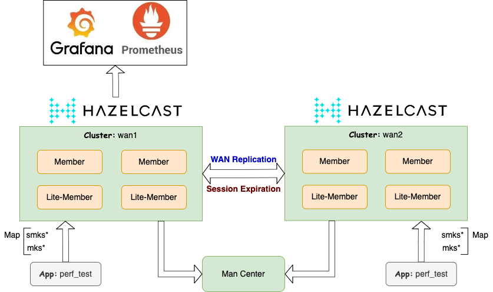
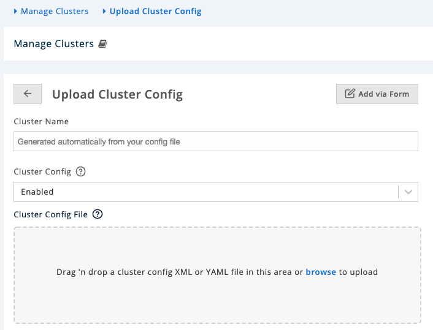
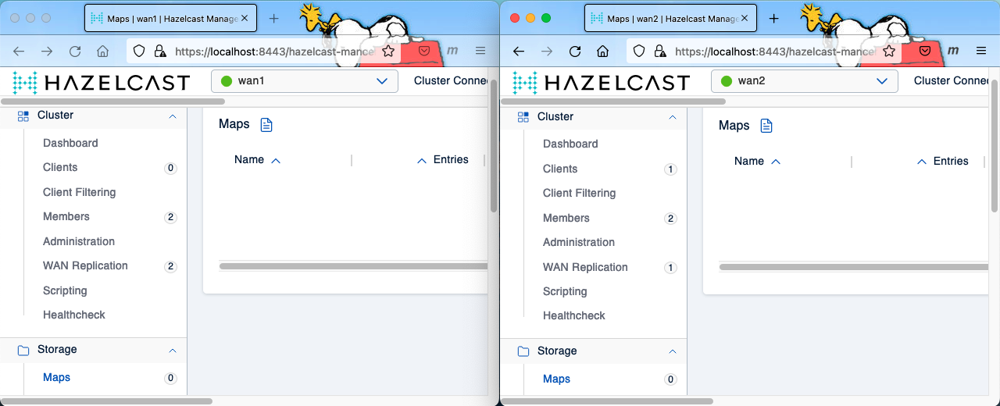
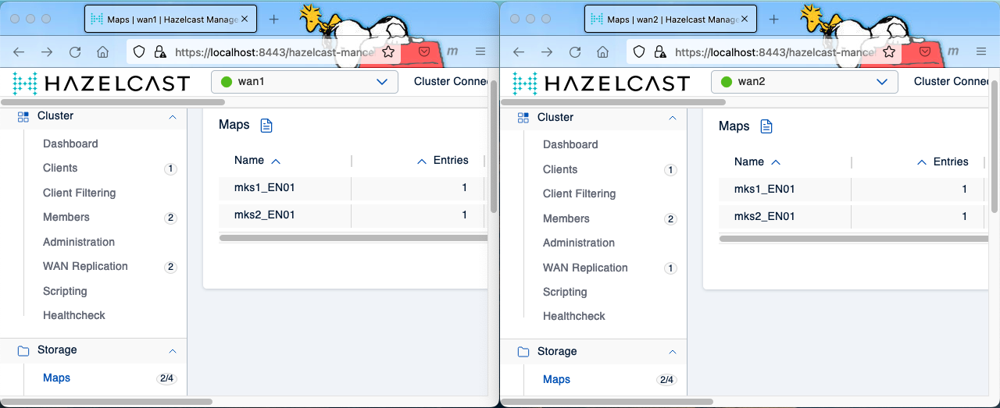
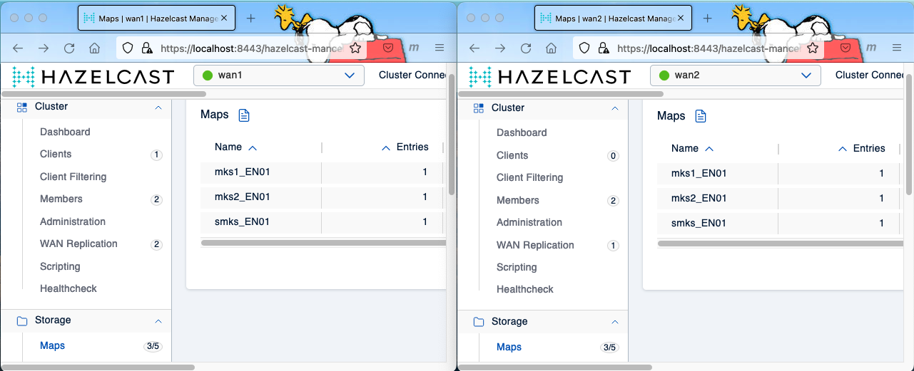
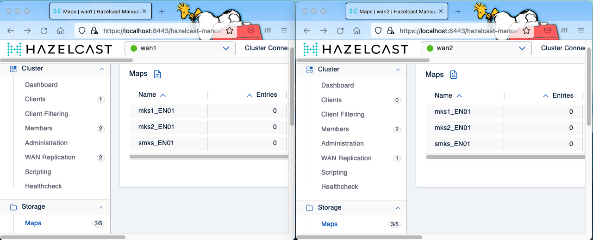
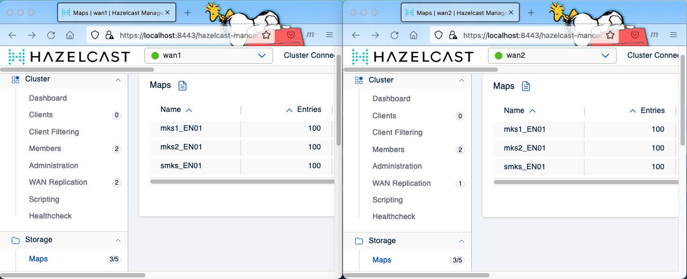
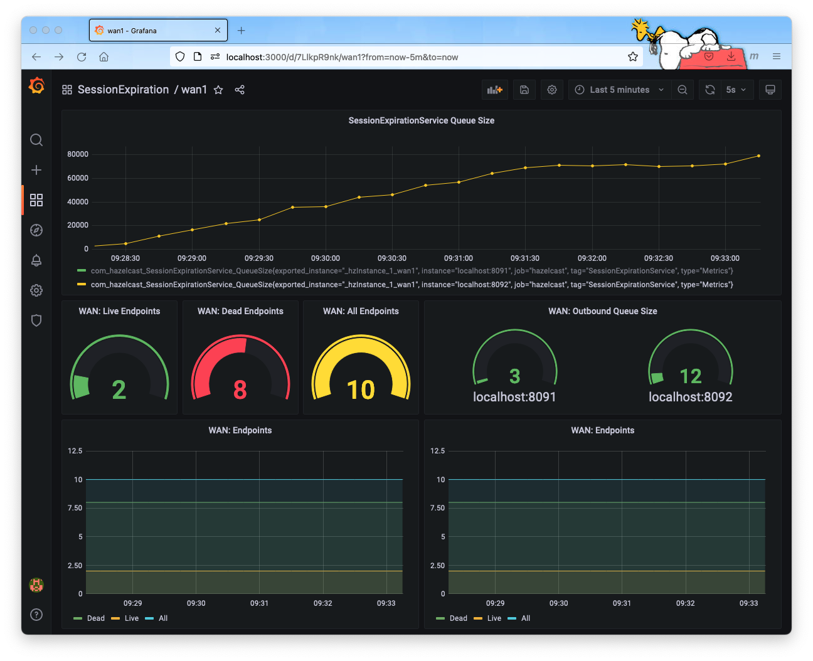

# Session Expiration in WAN Environment

This bundle demonstrates the session expiration plugin in a WAN environment. It incorporates the bundled [session expiration plugin](https://github.com/padogrid/bundle-hazelcast-4n5-cluster-session.git) and the Sorint.lab's [`IpDiscoveryStrategy`](https://github.com/sorint-lab-us/hazelcast-spi) plugin.

## Installing Bundle

Install the bundles as workspace by executing one of the following:

```bash
# To run
install_bundle -user sorint-lab-us -download -workspace bundle-hazelcast-4n5-cluster-session-wan

# To run and/or check in
install_bundle -user sorint-lab-us -checkout bundle-hazelcast-4n5-cluster-session-wan
```

## Use Case

This bundle creates a WAN environment consisting of two (2) clusters, two (2) `perf_test` apps, and one (1) `grafana` app for testing the session expiration plugin. It auto-configures SSL/TLS for all components and includes a Grafana dashboard template for monitoring the JMX metrics generated by the session expiration and `IpDiscoveryStrategy` plugins.



## Required Software

- [Maven 3.x](https://mirrors.advancedhosters.com/apache/)

## Optional Software

The following is a list of optional software. They are not required for running the session and WAN replication plugins.

- [Prometheus](https://prometheus.io/download/) 
- [Grafana](https://grafana.com/grafana/download)
- [jq](https://stedolan.github.io/jq)

## Bundle Contents

```console
apps
├── grafana
├── perf_test_wan1
└── perf_test_wan2

clusters
├── wan1
└── wan2
```

## OpenShift

This article provides instructions for testing the plugin in a local environment. For testing in OpenShift, follow the instructions provided in the link below.

[Session Plugin in OpenShift](README_K8S.md)

## Installation Steps

First, switch into the installed workspace:

```bash
switch_workspace bundle-hazelcast-4n5-cluster-session-wan
```

This bundle builds the test enviroment based on the Hazelcast and Management versions in your workspace. Make sure your workspace has been configured with the desired versions before building the demo environment. You can check the current workspace versions by running `show_products` and update versions by running `update_products` as shown below.

```bash
# List current workspace product versions
show_products

# If the desired versions are not listed then install
install_padogrid -product hazelcast-enterprise
install_padogrid -product hazelcast-mc

# Update hazelcast enterprise and managment center
update_products -hazelcast-enterprise
update_products -hazelcast-mc
```

This bundle has been configured to run full members (data nodes) and lite-members (compute nodes). By default, the first two members are full members and any additional members added thereafter are configured as lite-members. This setting is configurable in the each cluster's `bin_sh/setenv.sh` file. 

:pencil2: *If you want to increase the number of full members then set the `FULL_MEMBER_COUNT` environment variable in `bin_sh/setenv.sh` for both `wan1` and `wan2` clusters.*

Please select one of the initialization options below.

:pencil2: *You can ignore keytool errors which will be shown if you have already run the `build_app` script previously.*

### Initialization Option 1. Run Full Members with Smart Routing Enabled

```bash
# 1. Build SSL/TLS keystores and the IpDiscoveryStrategy plugin
#    Also, install bundle-hazelcast-4-k8s-oc_helm_wan.
switch_cluster wan1/bin_sh
./build_app

# 2. Add 2 members to wan1 and wan2 clusters
add_member -cluster wan1
add_member -cluster wan1
add_member -cluster wan2
add_member -cluster wan2

# 3. Initialize perf_test apps
cd_app perf_test_wan1/bin_sh
./init_app
cd_app perf_test_wan2/bin_sh
./init_app
```

### Initialization Option 2. Run Lite-Members with Smart Routing Disabled

To run clusters with a mix of full members and lite-members, add three (3) members and run the `init_app` script with the `-lite` option as shown below.

```bash
# 1. Build SSL/TLS keystores and the IpDiscoveryStrategy plugin
switch_cluster wan1/bin_sh
./build_app

# 2. Add 3 members to wan1 and wan2 clusters. 2 full and 1 lite-members per cluster
add_member -cluster wan1
add_member -cluster wan1
add_member -cluster wan1

add_member -cluster wan2
add_member -cluster wan2
add_member -cluster wan2

# 3. Initialize perf_test apps
cd_app perf_test_wan1/bin_sh
./init_app -lite
cd_app perf_test_wan2/bin_sh
./init_app -lite
```

## Hazelcast Enterprise License

This bundle requires a valid Hazelcast Enterprise license. Place your license key in the `.hazecastenv.sh` file in the RWE directory as follows.

```bash
cd_rwe
vi .hazelcastenv.sh
```

`.hazelcastenv.sh` Content:

```bash
IMDG_LICENSE_KEY=<IMDG license key>
MC_LICENSE_KEY=<Management Center license key>
```

## Startup Sequence

```bash
# 1. Start wan1 with management center and check status
start_cluster -cluster wan1 -all
show_cluster -cluster wan1

# 2. Start wan2 and check status. We'll use the wan1's MC to monitor both clusters.
start_cluster -cluster wan2
show_cluster -cluster wan2
```

3\. Configure Management Center

Follow one of the links below to enter the management center. It is found that the Hazelcast 4.x Management Center version used at the time of writing lacked support for the HTTPS protocol.

- Hazelcast 4.x: http://localhost:8443/hazelcast-mancenter
- Hazelcast 5.x: https://localhost:8443/hazelcast-mancenter

From the management center, add wan1 and wan2 cluster configs. The `init_app` scripts we ran in the [Installation Steps](#installation-steps) section generated the `hazelcast-client-mc.xml` file for each app. These files contain SSL/TLS configurations that we need to upload to the management center to create the wan1 and wan2 cluster views. They are located in the following directories.

```bash
# wan1 mc file
cd_app perf_test_wan1
cat etc/hazelcast-client-mc.xml

# wan2 mc file
cd_app perf_test_wan2
cat etc/hazelcast-client-mc.xml
```

From the management center, create the wan1 and wan2 views by uploading the above files.



4\. Start Prometheus

```bash
export PROMETHEUS_HOME=<prometheus home path>
export PATH=$PROMETHEUS_HOME:$PATH
cd_app grafana
prometheus --web.enable-admin-api --config.file=etc/prom-hazelcast.yml
```

5\. Start Grafana

```bash
export GRAFANA_HOME=<grafana home path>
export PATH=$PATH:$GRAFANA_HOME/bin
grafana-server -homepath $GRAFANA_HOME
```

6\. Import Grafana dashboards

```bash
cd_app grafana/bin_sh
./import_folder -all
```

Once the dashboards are imported, login to Grafana from the browser.

http://localhost:3000/

```console
User Name: admin
Password: admin
```

Open the **WanDiscovery** folder and click on the **wan1** dashboard.

## Test Cases

The wan1 and wan2 clusters are configured with their respective `etc/hazelcast.yaml` files. If XML files are preferred, then you can change it to the `etc/hazelcast.xml` file by editing the `bin_sh/setenv.sh` file.

```bash
# wan1 setenv.sh
cd_cluster wan1/bin_sh
vi setenv.sh

# wan2 setenv.sh
cd_cluster wan2/bin_sh
vi setenv.sh
```

Open Management Center in two separate browsers. The first one to monitor **wan1** and the second one to monitor **wan2**. We will be monitoring both clusters as we carry out test cases.



### Test Case 1. Session Replication by Key Type

In this test case, we enter entries into the primary map and its relevant maps to observe data replication and expiration from **wan1** to **wan2**.

```bash
cd_app perf_test_wan1/bin_sh
./start_hz_console
```

From the Hazelcast console, execute the commands in the `console-relevant.txt` file as follows. This script inserts entries in the session relevant maps.

```
@console-relevant.txt
```

You should see two (2) relevant maps, **mks1_EN01** and **mks2_EN02**, with 1 entry in each as shown below.



From the Hazelcast console, execute the commands in the `console-primary.txt` file as follows. This script inserts an entry in the session primary map named **smks_EN01**.

```
@console-primary.txt
```

You should now see all three maps in each cluster with 1 entry as shown below.



After idling for 10 seconds, all the maps in both clusters should expire as shown below.



Now, make the session active by repeatedly updating the primary map within the 10 second window.

```
@console-relevant.txt
@console-primary.txt

# wait >10 seconds execute
@console-primary.txt
# repeat within 10 seconds
@console-primary.txt
...
```

By updating the primary map, all the maps in both clusters retain the entries. As soon as idle for more than 10 seconds, both clusters will remove the session entries from all the maps.

### Test Case 2. Ingestion by Key Type

In the previous test case, we added one entry in each map and observed the entries getting replicated over the WAN and eventually expired in both clusters when the session sits idle for more than 10 seconds. In this test case, we perform load tests but we ingest a large number of entries.

The session expiration plugin supports several key types which determine how you will be creating keys. For example, the key type of `STRING` expects two tokens in the key separated by the delimiter. The default delimiter is "@". If the session ID is placed before the delimiter then it is called **prefix**. Likewise, if the session ID placed after the delimiter is called **postfix**. With this convention in place, the session expiration plugin extracts the session ID from the primary map keys and searches the keys to remove from the relevant maps when the primary map entries expire. This search is done by executing a `LIKE` predicate on each relevant map for each primary map key that expires. As you can guess, this is an expensive operation, especially, if the session ID is postfix. The postfix session ID executes the predicate `LIKE %session_id` and the prefix session ID executes the predicate, `LIKE session_id%`. For this reason, the default session ID placement is **prefix**.

Unlike the `STRING` key type, other key types do not build and execute query predicates and thus are significantly less expensive. This is because they require the key class to provide the session ID. For example, the `INTERFACE` key type expects the key class to implement `ISessionId.getSessionId()` and `PARTITION_AWARE` expects the `PartitionAware`.getPartitionKey()` to return the session ID.

The `test_session_ingestion` usage provides a comprehensive list of examples that you can try.

```bash
cd_app perf_test_wan1/bin_sh
# Display the usage
./test_session_ingestion -?
```

Let's ingest entries with `STRING` keys.

```bash
cd_app perf_test_wan1/bin_sh
./test_session_ingestion -type STRING -primary smks_EN01 -relevant mks1_EN01,mks2_EN01
```

You should see 100 entries in each map as shown below.



After 10 seconds of idle time, all the entries in the maps should expire as shown below.


You can change the number of entries to ingest by specifying the `-count` option. The following ingests 10,000 entries.

```
cd_app perf_test_wan1/bin_sh
./test_session_ingestion -type STRING -primary smks_EN01 -relevant mks1_EN01,mks2_EN01 -count 10000
```

### Test Case 3. Session Replication by `SessionMetadata`

In the previous test cases, we had the session expiration plugin to automatically search and remove the relevant entries. We can improve the performance by removing the search step. This is done by the application to provide the metadata that includes the relevant map names and their keys in the primary map key objects. The session expiration plugin provides the `SessionMetadata` class, which you can use in creating values (not keys) for the primary map. This class provides the following setter method for including the metadata.

```java
public void addRelevantKey(String mapName, Object key);
```

Let's experiment `SessionMetadata`. Before we begin, we must first reconfigure the Hazelcast clusters by specifying the corresponding configuration files. Edit the `bin_sh/setenv.sh` files as follows.

```bash
# Edit wan1 setenv.sh
cd_app wan1/bin_sh
vi setenv.sh

# Edit wan2 setenv.sh
cd_app wan2/bin_sh
vi setenv.sh
```

In each `setenv.sh` file, set the following.

```bash
CONFIG_FILE=$CLUSTER_DIR/etc/hazelcast-session-metadata-delete.yaml
```

Restart the clusters.

```bash
# Stop all clusters in the current workspace
stop_workspace

# Start all clusters in the current workspace
start_workspace -quiet
```

Once the clusters are running, execute the following command, which puts an entry to the primary map, `smks_EN01`, and two (2) entries to the relevant maps, `mks1_EN01` and `mks2_EN01`. The primary map entry has a `SessionMetadata` value object containing the relevent map information.

```bash
./test_session_ingestion -type STRING -primary smks_EN01 -relevant mks1_EN01,mks2_EN01 -entry PUT -session s1 -attribute a1 -metadata true
```

Observe the entries in all maps expire after 10 seconds. 

Now, make the session active by repeatedly updating the primary map within the 10 second window.

```bash
# PUT: Insert entries
./test_session_ingestion -type STRING -primary smks_EN01 -relevant mks1_EN01,mks2_EN01 -entry PUT -session s1 -attribute a1 -metadata true

# RESET: wait >10 seconds and execute
./test_session_ingestion -type STRING -primary smks_EN01 -relevant mks1_EN01,mks2_EN01 -entry RESET -session s1 -attribute a1 -metadata true
# RESET: repeat within 10 seconds
./test_session_ingestion -type STRING -primary smks_EN01 -relevant mks1_EN01,mks2_EN01 -entry RESET -session s1 -attribute a1 -metadata true
```

:pencil2: The `-entry RESET` option updates the primary map only. It does not update the the relevant maps. It updates `SessionMetadata` in the primary map with the specified relevant map names. 

### Test Case 4. Ingestion by `SessionMetadata`

The `test_session_ingestion` command puts `SessionMetadata` values for the option, `-entry INGEST`, regardless of the key type, i.e., `-type`. You can specify any key type and will get the same results. This is because the key type does not apply since the primary map values now provide the relevant data information.

Let's ingest `STRING` keys.

```bash
./test_session_ingestion -type STRING -primary smks_EN01 -relevant mks1_EN01,mks2_EN01
```

The above command puts 100 entries in each map. Try again with a larger number of entries. The following puts 10,000 entries.

```bash
cd_app perf_test_wan1/bin_sh
./test_session_ingestion -type STRING -primary smks_EN01 -relevant mks1_EN01,mks2_EN01 -count 10000
```

## Prometheus/Grafana

There are two (2) dashboards included in the bundle: *wan1* and *wan2*. You can find these dashboards under the **SessionExpiration** folder. You can import the dashboards by following in the instructions described in the [Startup Sequence](#startup-sequence) section. The following screenshot shows the *wan1* dashboard.



The screenshot shows the queue size steadily increasing. This is expected as you conduct load tests with a small value of `idle-time-seconds`. In our test cases, it is set for 10 seconds so that we can quicly observe expirations without waiting for a long period of time. This also means while ingesting data, the map entries are being expired at the same rate, leading to the steady queue size increase. This is particularly noticeable for the `STRING` key type due to the expensive `LIKE` search done per each primary map entry expiration event as described in [Test Case 2](#test-case-2-ingestion-by-key-type). For other key types, we have seen the queue properly drained without any significant incase in size. You can try it for yourself.

The current session expiration plugin spawns a single thread to handle the blocking queue. It drains the queue a batch at a time as fast as it can. It iterates each batch of events and performs either the `delete` or `get` operation depending on the type of `SessionExpirationService` is set in the configuration file. This step generates additional events within Hazelcast and may consume a significant amount of system resources, in particular, CPUs. Unfortunately, Hazelcast does not provide the API that simply reset the idle timeout and this is all we can do for now.

## Teardown

```bash
# 1. Stop clients (Ctrl-C to stop perf_test clients)

# 2. Stop workspace
stop_workspace -all

# 3. Stop Prometheus and Grafana (Ctr-C)
```

## Summary

This bundle demonstrates the session expiration plugin in an WAN environment. The session expiration plugin allows session data to expire from all the session relevant maps by "touching" the primary map. This bundle also incorporates the `IpDiscoveryStrategy` plugin which drastically improves the WAN replication performance for the environment that has unreachable target endpoints. It includes several test cases along with cluster monitoring instructions for performing detailed analysis of plugins.

## References

1. Hazelcast SPI, *IpDiscoveryStrategy plugin by Sorint.lab*, **Private Repo**, https://github.com/sorint-lab-us/hazelcast-spi.
2. `IpDiscoveryStrategy` Plugin Test Harness, *IpDiscoveryStrategy plugin by Sorint.lab*, **Private Repo**, https://github.com/sorint-lab-us/bundle-hazelcast-4n5-wan_discovery.
3. Session Expiration Management Plugin, https://github.com/padogrid/bundle-hazelcast-4n5-cluster-session.
